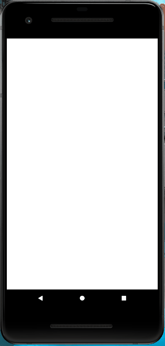

# React Native - Encurtador de links

- Navigator drawerContentOptions mudou (V 6.x) para screenOptions e também suas propriedades (drawerActiveBackgroundColor e drawerActiveTintColor, por exemplo).
    ```bash
    <Drawer.Navigator
    screenOptions={{
        //options for drawer
        drawerLabel
        drawerIcon
        drawerActiveTintColor
        drawerActiveBackgroundColor
        drawerInactiveTintColor
        drawerInactiveBackgroundColor
        drawerItemStyle
        drawerLabelStyle
        drawerContentContainerStyle
        drawerContentStyle
        drawerStyle
    }}
    />

- KeyboardAvoidingView - Para melhor experiência de usuários, quando clicar no campo de text e abrir o teclado, ele não ficará por cima da tela. O App vai para cima ficando visível sua visualização.
- TouchableWithoutFeedback - Utilizado para fechar o teclado quando clicar em alguma parte da tela fora do contexto em que está.
- Platform - Permite verificar se o usuário está utilizando o app em um android ou ios.
- Modal - Uma maneira básica de apresentar o conteúdo acima de uma visualização envolvente.
- ActivityIndicator - Exibe um ícone circular personalizável que mostra que está carregando (Loading).
- useIsFocused - Possibilidade de alternar telas.
- Swipeable - Permite linhas deslizar e interações (Ex. Quando uma linha é arrastada para o lado, aparece um botão de excluir a linha).
- Share - Abre uma caixa de diálogo para compartilhar o conteúdo que está contextualizado.
- AsyncStorage - Permite fazer persistência de dados offline.
- Consumo de api via axios.


<br><br>


# Demonstração do funcionamento



